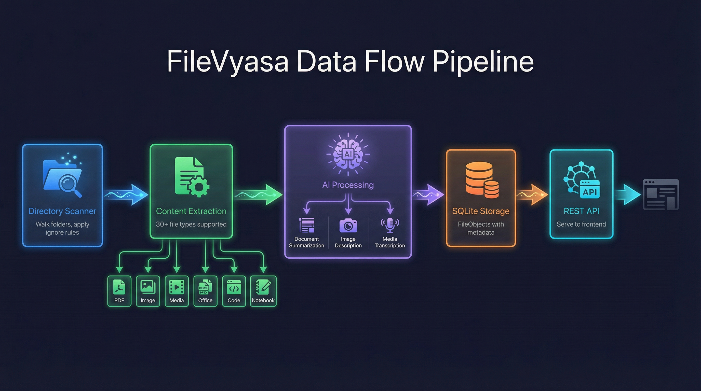

# FileVyasa — AI-Powered Local File Organizer

A desktop application that scans local directories, extracts content from files, and uses AI to generate summaries, describe images, and transcribe media—helping you understand and organize your filesystem.

## Vision

FileVyasa is a personal AI assistant that scans, understands, and organizes local files. It proposes clear folder hierarchies, safely moves or renames file items. The goal is to make finding and organizing files as effortless as conversing with an intelligent librarian who knows your work.

**Current Status:** v1.1 — Scan, extract, and summarize files with AI. Future versions will add clustering, folder planning, and safe file reorganization.

## Features

- **Smart Folder Monitoring** — Add folders to monitor, auto-detect changes on re-sync
- **Content Extraction** — Supports 30+ file types including documents, images, media, code, and archives
- **AI Summarization** — Generate concise summaries for documents using local (Ollama) or cloud LLMs (100+ providers via LiteLLM)
- **Image Description** — AI-powered descriptions for photos and images via Ollama llava
- **Media Transcription** — Audio/video transcription via faster-whisper (local, no API needed)
- **OCR Support** — Extract text from image-based PDFs using python-doctr
- **Google Workspace** — Extract content from Google Docs and Sheets (service account required)
- **Desktop App** — Native cross-platform Tauri app with file browser, search, and filtering
- **Parallel Processing** — Configurable concurrent extraction and AI processing for fast scans

## Architecture


### Data Flow Pipeline



## Project Structure

```
file-vyasa/
├── backend/          # Python FastAPI backend (v1.1.0)
├── frontend/         # Tauri 2.x + React 19 desktop app
├── agentic_development_docs/  # Design docs and roadmap
├── handle_file_types/  # File type handling utilities
└── sample_data/      # Test data for development
```

## Quick Start

### Prerequisites
- Python 3.11+ with [uv](https://github.com/astral-sh/uv)
- Node.js 18+ with pnpm
- Rust (for Tauri desktop app)
- [Ollama](https://ollama.ai) (recommended for local AI) or cloud LLM API key

### Running

**Backend:**
```bash
cd backend
uv sync
uv run python run.py
```

**Frontend:**
```bash
cd frontend
pnpm install
pnpm tauri:dev
```

Both services must run concurrently. The frontend connects to the backend at `http://127.0.0.1:8000`. Visit `/docs` for Swagger API documentation.

## LLM Configuration

FileVyasa uses [LiteLLM](https://docs.litellm.ai/docs/providers) which supports 100+ LLM providers.

### Ollama (Local, Recommended)
```bash
ollama pull llama3.2        # For document summaries
ollama pull llava           # For image descriptions (optional)
```
No API key required—runs entirely on your machine.

### Cloud Providers (OpenAI, Anthropic, Gemini, Groq, DeepSeek, etc.)
```bash
export FILEVYASA_LLM_API_KEY=your-key-here
```

Configure provider/model in the Settings panel or `backend/config/settings.yaml`.

## Supported File Types

| Category | Extensions |
|----------|------------|
| Documents | PDF (with OCR), DOCX, XLSX, PPTX, TXT, MD, RTF |
| Images | JPG, PNG, GIF, WEBP, HEIC, BMP, TIFF |
| Media | MP3, MP4, WAV, FLAC, M4A, MOV, AVI, MKV, WEBM, OGG |
| Code | PY, JS, TS, HTML, CSS, JSON, YAML, XML, and more |
| Notebooks | IPYNB (Jupyter) |
| Web | HTML, HTM, XML |
| Archives | ZIP, TAR, GZ, RAR, 7Z (metadata only) |
| Google | Google Docs, Google Sheets (via service account) |

## Roadmap

- **v1.1** (Current) — Scan, extract, summarize with AI
- **v1.2** — Structured file objects, detail panel, filters
- **v1.3** — Clustering via Constella, folder planning board (preview)
- **v1.4** — Action planning with approval state (no execution)
- **v1.5** — Safe executor with rollback, duplicate detection

See [design docs](agentic_development_docs/project_design_plan/) for detailed plans.

## Documentation

- [Backend README](backend/README.md) — API endpoints, configuration, extractors, development
- [Frontend README](frontend/README.md) — UI architecture, components, building, development