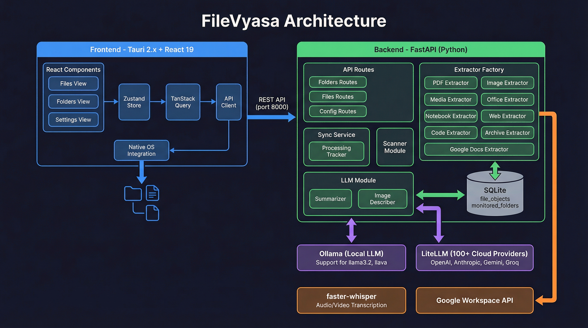
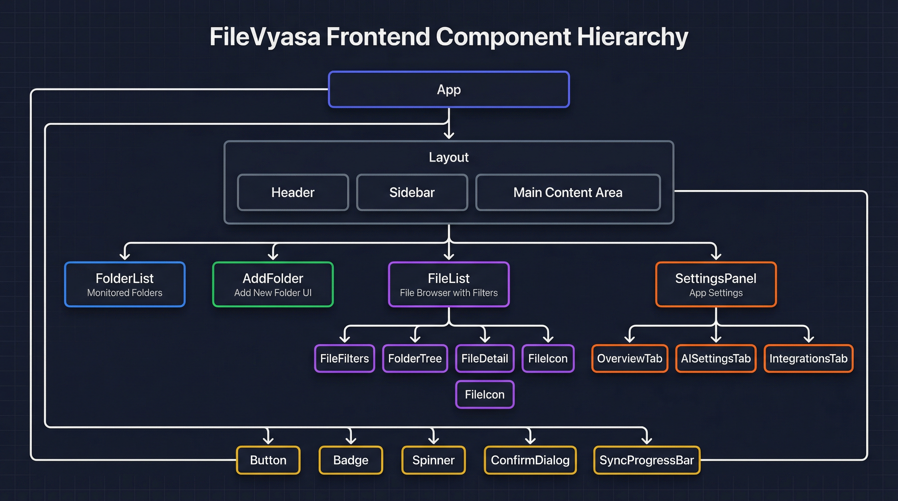

# FileVyasa Frontend

Cross-platform desktop app built with Tauri 2.x + React 19.

## Architecture



### Component Hierarchy



## Tech Stack

- **Framework**: Tauri 2.x + Vite 7 + React 19 (TypeScript)
- **Styling**: Tailwind CSS v4 (dark theme)
- **State**: Zustand 5 + TanStack Query 5
- **UI**: Radix UI primitives (Dialog, Select, Tabs, Tooltip) + Lucide icons
- **Native**: Tauri plugins for dialog, shell, and file operations

## Quick Start

```bash
pnpm install
pnpm tauri:dev
```

Requires the backend running at `http://127.0.0.1:8000`.

## Building

```bash
pnpm tauri:build
```

Outputs:
- macOS: `src-tauri/target/release/bundle/macos/FileVyasa.app`
- Windows: `src-tauri/target/release/bundle/msi/`
- Linux: `src-tauri/target/release/bundle/appimage/`

## Project Structure

```
frontend/
├── src/
│   ├── api/
│   │   └── client.ts      # Typed backend API client
│   ├── components/
│   │   ├── common/        # Button, Badge, Spinner, ConfirmDialog, SyncProgressBar
│   │   ├── files/         # FileList, FileDetail, FileFilters, FileIcon, FolderTree
│   │   ├── folders/       # AddFolder, FolderList, FolderInfoCard, FolderStatusBadge
│   │   ├── layout/        # Sidebar, Header, Layout
│   │   └── settings/      # SettingsPanel with tabs (Overview, General, AI, Integrations)
│   ├── hooks/             # Custom React hooks
│   ├── lib/               # Utility functions (syncUtils, cn)
│   ├── stores/
│   │   └── appStore.ts    # Zustand global state
│   └── types/             # TypeScript interfaces
└── src-tauri/             # Tauri Rust backend + plugins
```

## Features

### Folder Management
- **Add Folders** — Select folders via native dialog, configure sync options
- **Sync Options** — Toggle document summaries, image descriptions, media transcription
- **Ignore Patterns** — Custom patterns to exclude files/folders
- **Live Progress** — Real-time sync progress with ETA and files/sec
- **Cancel Sync** — Stop ongoing sync operations

### File Browser
- **List View** — Paginated file list with category icons
- **Folder Tree** — Navigate folder hierarchy
- **Search** — Filter by filename
- **Category Filters** — Document, Image, Media, Code, Notebook, Archive, Other
- **Status Filters** — Filter by extraction status

### File Details
- **Metadata** — Size, dates, path, MIME type, inode
- **EXIF Data** — Camera info, GPS, dimensions for images
- **Content Preview** — Extracted text preview (first N lines)
- **AI Summaries** — Brief (~2 lines) and detailed (~4 lines) summaries
- **Model Info** — Which LLM generated the summary

### Settings Panel
- **Overview** — App info and quick status
- **General** — UI preferences
- **AI** — Configure LLM provider, model, API base/key; check llava status
- **Integrations** — Google Workspace credentials setup and verification

### Backend Connection
- Auto-detects backend availability
- Shows disconnected state with retry
- Health check polling every 30 seconds

## Views

| View | Description |
|------|-------------|
| `folders` | List of monitored folders with status |
| `add-folder` | Add new folder to monitor |
| `files` | File browser with list + detail panel |
| `settings` | Configuration settings |

## Development

```bash
pnpm dev        # Web-only dev server (no Tauri features)
pnpm tauri:dev  # Full desktop app with hot reload
pnpm lint       # ESLint check
pnpm build      # Production build (web only)
pnpm tauri:build # Production desktop app
```

## API Client

The `api` client in `src/api/client.ts` provides typed methods for all backend endpoints:

```typescript
import { api } from '@/api/client';

// Folders
await api.folders.add({ root_path: '/path/to/folder', ... });
await api.folders.list();
await api.folders.sync(folderId);
await api.folders.cancel(folderId);

// Files
await api.files.list({ folder_id, categories, search, page, page_size });
await api.files.get(fileId);

// Config
await api.config.get();
await api.config.updateLLM({ provider, model, api_key });
await api.config.checkLlavaStatus();
```
